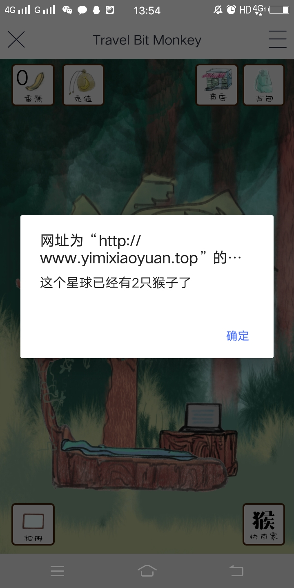
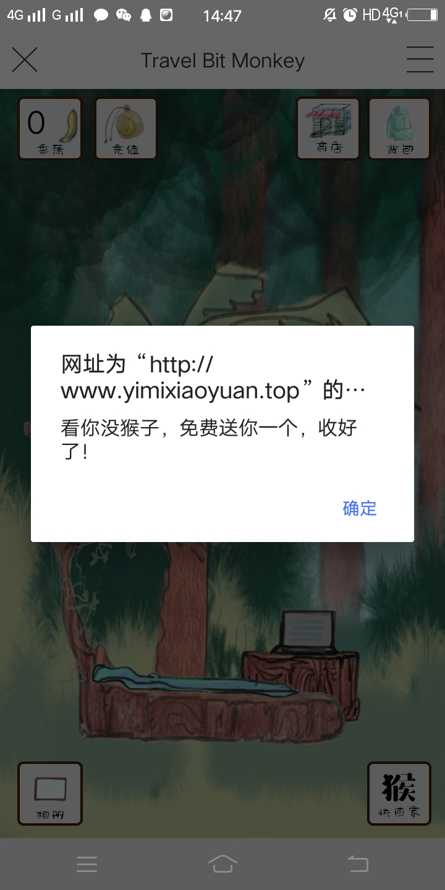
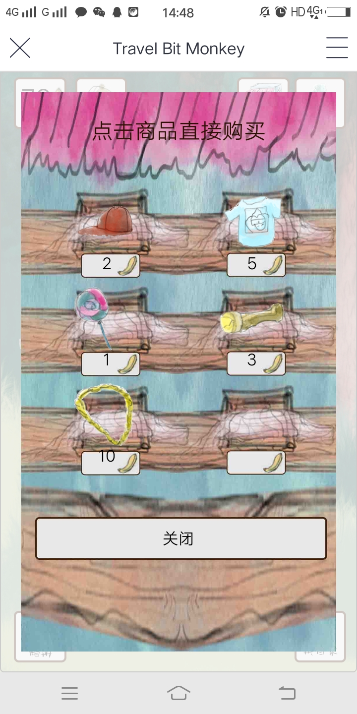
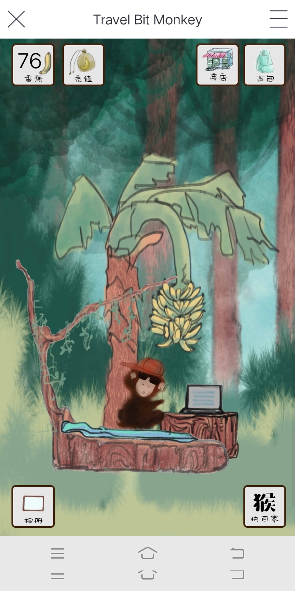
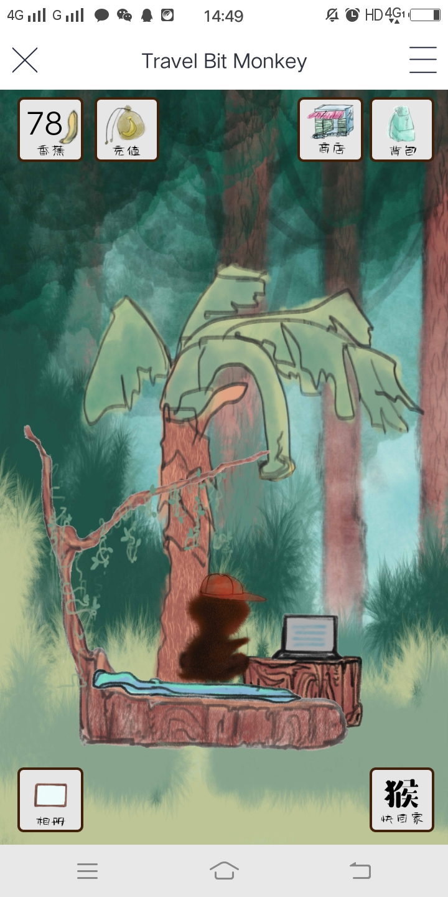
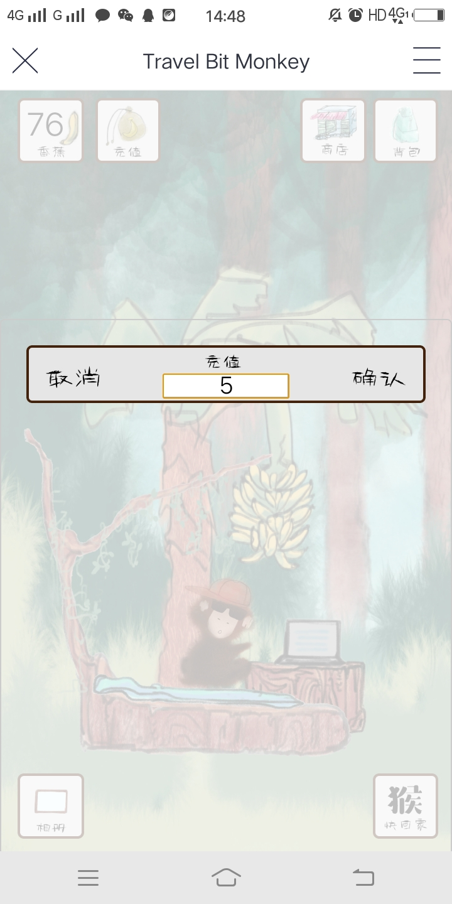
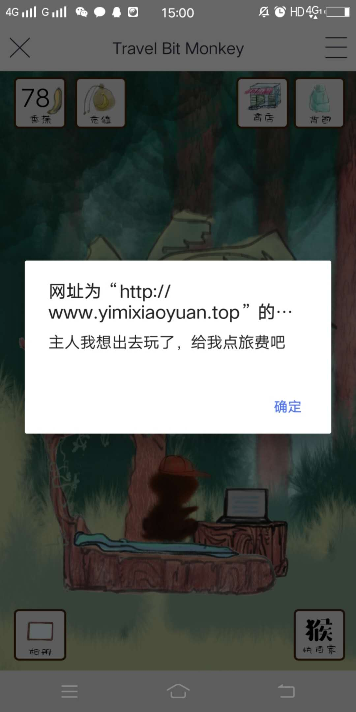

# TravelMonkey开发文档

## TravelMonkey介绍
* 游戏简介

    **TravelMonkey**(旅行猴),是一款基于```Nervos```的```AppChain```开发的一款纯手绘区块链佛性游戏，travel monkey也是游戏的主人公，一只喜欢旅行的猴子，调皮的小猴子就像家长们的孩子一样，喜欢偷偷背着主人做事，喜欢发脾气甚至离家出走，为了让自己的孩子开心，玩家可以买各种东西讨好自己的宠物。小猴子怕主人担心，在旅途中也会给主人寄回来明信片，小猴子在旅途中会认识各种各样的好朋友，也有可能会带回家里面做客，下面我们看下具体玩法。


* Nervos AppChain简介

    **Nervos AppChain** 是开源免费的商业级应用公链解决方案，采用强力节点作为记账基础设施，提供高性能的计算和应用或行业共识，支持多链协议。AppChain 产品栈除了区块链内核 CITA 外，还包含 DApp 手机钱包 Neuron 、区块链浏览器 Microscope 以及全平台 SDK。 Nervos AppChain 主要为 B 端用户解决「搭建区块链困难」和「开发区块链应用困难」这两个区块链落地的核心问题。

> 注意: 该文档针对对区块链有一定了解的开发者，且对智能合约有一定了解

* Neuron 简介

    **Neuron** 是一个 DApp 浏览器和一个支持 AppChain 和以太坊的区块链钱包。构建在 AppChain 或多个 AppChains 之上的 DApps 可以在 Neuron 中使用。用户可以通过区块链获得安全和无缝的交互体验。

## 运行环境

* MacOs 10.14
* Node  10.10.0
* Npm   6.4.1
* Vim   8.0

## 安装

* [node安装](https://nodejs.org/en/download/)
* [npm安装](https://www.npmjs.com/)

## Nervos Appchain上部署合约

   * 在运行该项目前 我们先了解下怎么在Nervos的Appchain中部署合约, 该demo中所有内容都配置好了，
   如果只是想运行的用户可以直接跳到运行。
  
   
   * 首先把自己写好的```sol```文件，在[Remix](https://remix.ethereum.org/)上调试好，拿到自己的
     ```abi```和```bytecode```
   * 首先进入```contracts```目录, 我们看到有五个文件
   
   ```bash
    $ cd Travel_Monkey/src/contracts
        ├── compiled.js
        ├── deploy.js
        ├── CoreContract.sol
        ├── transaction.js
        └── chain.js
   ```
   * 我们将之前得到的abi和byte_code填入compiled.js文件中,然后exports出来:
   
   
```js
module.exports = {
        abi,
        bytecode
    }
```

   * 最后执行```deploy.js```文件完成部署:
   
   ```bash
$ node deploy.js
```
   
## Nervos Appchain上自定义配置

   * 之后我们在```Travel_Monkey/src/config.js```文件中修改自己的配置信息以及
   使用哪条公链的信息,这里使用的是```http://121.196.200.225:1337```
   
   ```js
    const config = {
        chain: 'http://121.196.200.225:1337',
        contractAddress: '0x9Cf7a2062AE3b87036cF04FE9555d4e4ddCed5ca',
        apiAddress:'http://58.87.125.190:9999',
        pc_media: "(min-width:31em)",
    }
        
   ```
   
   * 所有需要自己配置的大部分就是这些，demo中都已经配置了一套，
   有兴趣可以自己试着配一套


## 运行

* 项目克隆到本地

```bash
$ git clone https://github.com/MrPaoBrother/Travel_Monkey.git

$ cd Travel_Monkey
```

* 安装相关依赖

```bash
$ npm i

```

> 安装完成之后，项目根目录下会看到多出了```node_modules```文件.

* 项目运行

```bash
$ npm run start
Starting the development server...
```

> 可能会看到一堆的warning， 没关系， 只要没有Error就行, 有一些是对依赖库版本的警告

* 最后打开浏览器运行 ```http://localhost:3000/```


## 项目说明

### 前端部分

* 前端基于React，Redux框架，通过媒体查询自适应手机端

### 文件结构

* ./node_modules 文件夹下是运行所需要的第三方库

* ./public 文件夹下是前端引用的静态文件
 
* ./readme_images 是程序的部分截图

* ./src 文件夹下是核心代码

* ./src/components 下是网页中用到的组件

* ./src/containers 下是网站的各个页面，目前我们是单页的，所以只有一个Home文件夹

* ./src/contracts 下是合约相关的文件

* ./src/images 下是网站本地的图片

* ./src/store 下是redux相关的文件，下一个版本将引入redux和redux saga，这个版本暂时没用到 

* ./src/config.js 合约的配置文件，包括用的链的地址，用户私钥，用户地址，合约地址，后台服务器的地址


### 合约相关的函数

* ./src/contracts/chain.js 中引用了大部分的合约函数，多数函数名和合约上的函数名一致

* getMonkeycount() 是从合约上获取当前猴子数量的函数

* checkFirst() 是从合约上获取当前用户是否拥有猴子的函数

* getBananacount() 是用户从合约上获取香蕉树上可供收割香蕉数量（游戏中的积分）的函数

* getMonkey() 是用户从合约上获取自己的猴子的详细信息的函数

* getowner2picture() 是用户从合约上获取自己猴子的照片墙上照片的ID的数组的函数

* getPicture() 是用户从合约上获取ID对应的照片的详细信息的函数

* getowner2product() 是用户从合约上获取自己猴子的背包里物品的ID的数组的函数

* getProductlength() 是从合约上获取当前商城所有商品数量的函数

* getProduct() 是用户从合约上获取ID对应的物品的详细信息的函数

* freeMonkey() 是用户在没有猴子时从合约上获取一只新猴子的函数

* addBanana() 是用户从合约上充值香蕉的函数

* getBananaFromTree() 是在合约中从香蕉树上收获香蕉的函数

* buyProduct() 是用户从合约上购买商品的函数

* checkWalkout() 是从合约上允许猴子出去旅行的函数

* backHome() 是用户让猴子回家的函数


### 后台服务器相关的函数(暂不开源)

* story_happen() 是从服务器发送跟踪猴子旅行故事请求的函数

* get_monkey_status() 是从服务器中发送返回猴子旅行状态的函数

* go_home() 新版本为了更好的和用户进行交互，新增强制让猴子回家功能

## 相关优化([相比web版本](https://github.com/MrPaoBrother/Travel_Monkey/blob/master/README.md))

### 功能方面
   * 新增呼唤猴子回家功能
   * 修改猴子出去要和主人打招呼功能
   * 新增新场景和朋友
### 技术优化
   * 图片渲染速度提升50%
   * 链数据不稳定，新增降级方案
   * 部分图片重新设计优化
   * 重构旅行途中地图功能代码


## 效果展示

* 登录时会显示当前已经存在的猴子数量



* 领取猴子




* 游戏商城，点击物品直接购买




* 玩家的背包


* 购买前的猴子


* 购买后猴子穿上了衣服




* 香蕉树上有香蕉时，可以点击香蕉收割


* 香蕉被收割



* 可以通过充值获取更多香蕉




* 小猴子想旅行了，支付一点旅费



* 小猴子想回家了，支付一点旅费


* 小猴子旅行时寄回来的照片


* 小猴子在用电脑看什么


## 参考资料

[1] [Nervos AppChain 文档](https://docs.nervos.org/nervos-appchain-docs/#/)

[2] [Nervos Neuron 钱包](https://mp.weixin.qq.com/s/U7JK_vpIzVLCwv99cmxPAA)


